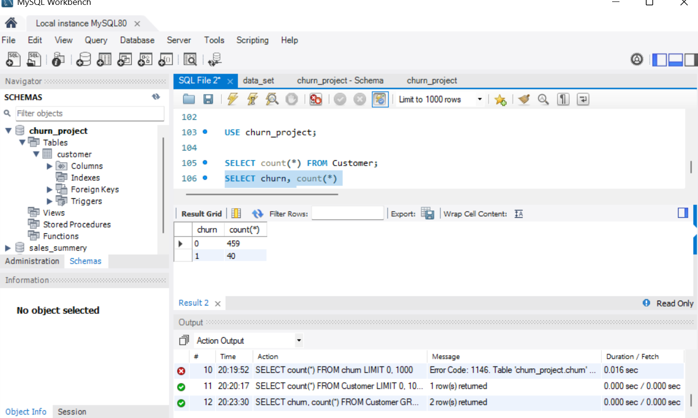
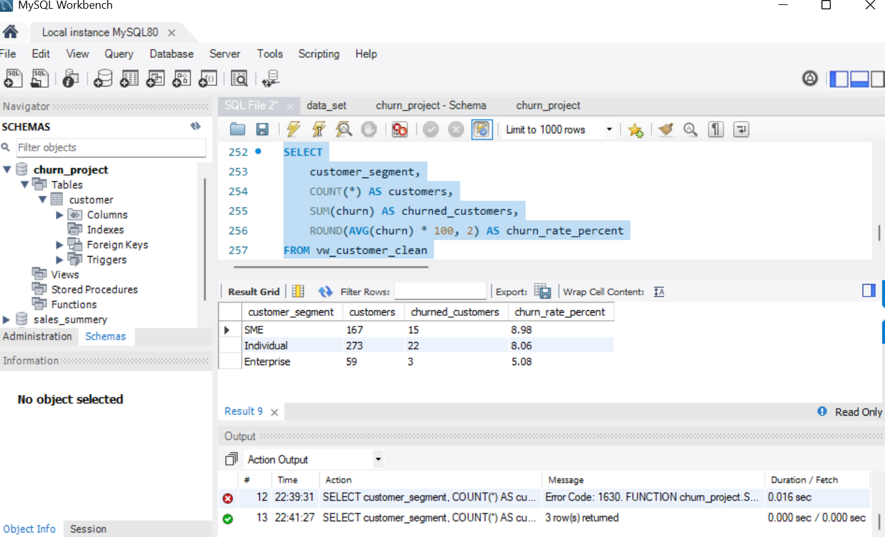
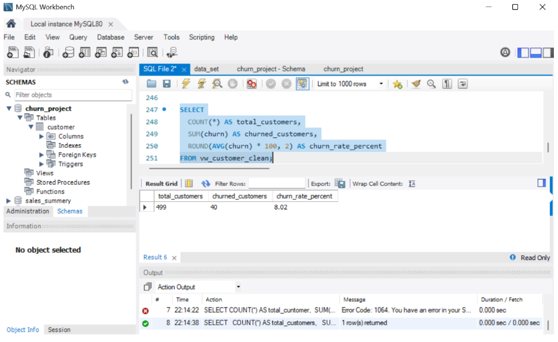

# 📊 Customer Churn Analysis using SQL

## 🔍 Overview
This project analyzes customer churn patterns and identifies high-risk segments using SQL to understand churn rate, customer distribution, and segment-level behavior. The goal is to generate insights that support customer retention strategies.

## 🛠 Tools Used
- SQL
- MySQL Workbench

## 📈 Key Insights
- Calculated total customer churn rate
- Compared churned vs non-churned customers
- Analyzed customer distribution across churn status
- Identified patterns using aggregation and grouping

## 📊 Project Screenshots

### Record Counting & Data Exploration

### Customer Distribution & Churn Analysis

### Customer Churn Metrics

---

## 🚀 Project Purpose
This project demonstrates how SQL can be used to analyze customer behavior and generate business insights related to churn and retention.
